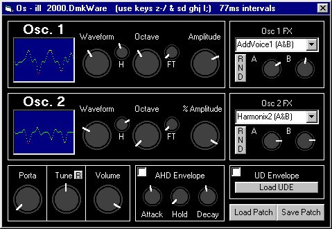



## Os \- ill Synthesizer \*Update 3\*

### Description

Same 2 osc. synth. New features: Save the machine state (patch). Higher resolution. Load user drawn envelopes (UDE). Uses an xternal program (with source) to draw these envelopes. smoothing! NOTE: No new effects have been added >>YET<<.

New interface!

Knob OCX is now a private usercontrol. It also has a new look. The waveform monitor now in fading color. Good samples are from green to yellow, bad samples are bright red (&HFF)

The decay bug is no more! **just fixed UDE amplitude problem.Osc1 & Osc2s amp are totally editable now**
 
### More Info
 

             |
---                |---
**Submitted On**   |2000-09-29 15:19:34
**By**             |[Dave Katrowski](https://github.com/Planet-Source-Code/PSCIndex/blob/master/ByAuthor/dave-katrowski.md)
**Level**          |Intermediate
**User Rating**    |4.8 (19 globes from 4 users)
**Compatibility**  |VB 5\.0, VB 6\.0
**Category**       |[Sound/MP3](https://github.com/Planet-Source-Code/PSCIndex/blob/master/ByCategory/sound-mp3__1-45.md)
**World**          |[Visual Basic](https://github.com/Planet-Source-Code/PSCIndex/blob/master/ByWorld/visual-basic.md)
**Archive File**   |[CODE\_UPLOAD102739292000\.zip](https://github.com/Planet-Source-Code/dave-katrowski-os-ill-synthesizer-update-3__1-11758/archive/master.zip)

